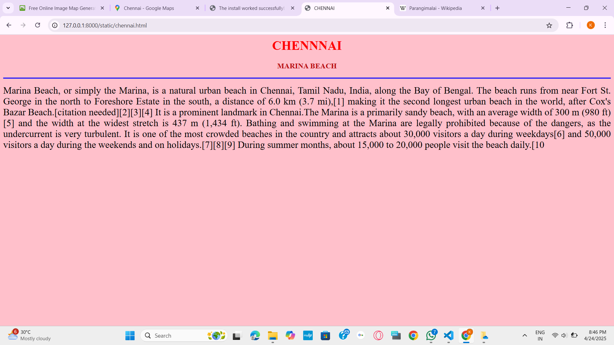

# Ex04 Places Around Me
## Date: 20.04.2025

## AIM
To develop a website to display details about the places around my house.

## DESIGN STEPS

### STEP 1
Create a Django admin interface.

### STEP 2
Download your city map from Google.

### STEP 3
Using ```<map>``` tag name the map.

### STEP 4
Create clickable regions in the image using ```<area>``` tag.

### STEP 5
Write HTML programs for all the regions identified.

### STEP 6
Execute the programs and publish them.

## CODE

```
map.html
<html>
<head>
<title> MY CITY</title>
</head>
<body>
<h1 align="'center">
<center>
<font color="blue"><b>CHENNAI</b></font>
</center>
</h1>
<h3 align="centre">
<center>
<font color="babyblue"><b> KESHAVARTHINI B (24900033)</b></font>
</center>
</h3>
<center>

    

    <map name="image-map">
    <area target="_parent" alt="CHENNAI" title="CHENNAI" href="chennai.html" coords="1328,260,113" shape="circle">
    <area target="_parent" alt="ADYAR" title="ADYAR" href="adyar.html" coords="1214,463,73" shape="circle">
    <area target="_parent" alt="ST.THOMAS MOUNT" title="ST.THOMAS MOUNT" href="stmount.html" coords="1011,425,90" shape="circle">
    <area target="_parent" alt="MYLAPORE" title="MYLAPORE" href="mylapore.html" coords="777,181,1079,300" shape="rect">
</map>
</center>
</body>
</html>

chennai.html

<html>
<head>
<title> CHENNAI</title>
</head>
<body bgcolor="pink">
<h1 align="'center">
<center>
<font color="red"><b>CHENNNAI</b></font>
</center>
</h1>
<h3 align="centre">
<center>
<font color="babyblue"><b> MARINA BEACH</b></font>
</center>
</h3>
<hr size="3" color="blue">
<p align="justify">
    <font face="yellow" size="5">
        Marina Beach, or simply the Marina, is a natural urban beach in Chennai, Tamil Nadu, India, along the Bay of Bengal. The beach runs from near Fort St. George in the north to Foreshore Estate in the south, a distance of 6.0 km (3.7 mi),[1] making it the second longest urban beach in the world, after Cox's Bazar Beach.[citation needed][2][3][4] It is a prominent landmark in Chennai.The Marina is a primarily sandy beach, with an average width of 300 m (980 ft)[5] and the width at the widest stretch is 437 m (1,434 ft). Bathing and swimming at the Marina are legally prohibited because of the dangers, as the undercurrent is very turbulent. It is one of the most crowded beaches in the country and attracts about 30,000 visitors a day during weekdays[6] and 50,000 visitors a day during the weekends and on holidays.[7][8][9] During summer months, about 15,000 to 20,000 people visit the beach daily.[10
    </font>
</p>
</body>
</html>

adyar.html

<html>
<head>
<title> CHENNAI</title>
</head>
<body bgcolor="green">
<h1 align="'center">
<center>
<font color="blue"><b>ADYAR RIVER</b></font>
</center>
</h1>
<h3 align="centre">
<center>
<font color="babyblue"><b> ADYAR</b></font>
</center>
</h3>
<hr size="3" color="cyan">
<p align="justify">
    <font face="Georgia" size="5">
        The Adyar River, which originates near the Chembarambakkam Lake in the Kanchipuram district, is one of the three rivers that winds through Chennai, Tamil Nadu, India, and joins the Bay of Bengal at the Adyar estuary. The 42.5-kilometre (26.4 mi) long river contributes to the estuarine ecosystem of Chennai. Despite the high pollution levels, boating and fishing take place in this river. The river collects surplus water from about 200 tanks and lakes, small streams and the rainwater drains in the city, with a combined catchment area of 860 square kilometres (331 sq mi). Most of the waste from the city is drained into this river and the 
    </font>
</p>
</body>
</html>

stmount.html

<html>
<head>
<title> CHENNAI</title>
</head>
<body bgcolor="cyan">
<h1 align="'center">
    <center>
<font color="blue"><b>ST.THOMAS MOUNT</b></font>
</center>
</h1>
</h1>

<h3 align="centre">
<center>
<font color="babyblue"><b> ST.THOMAS MOUNT</b></font>
</center>
</h3>
<hr size="3" color="cyan">
<p align="justify">
    <font face="Georgia" size="5">
        Parangimalai (known in English as St. Thomas Mount) is a small hillock in the Chennai district of Tamil Nadu, India, near the neighbourhood of Guindy and very close to Chennai International Airport. By extension, it is also the name of the neighbourhood surrounding the hillock.

The neighbourhood is served by the St. Thomas Mount railway station, on the southern line of the Chennai Suburban Railway Network.[citation needed] Integration of the Metro and MRTS with the suburban station in the neighbourhood, is expected to make the suburb the city's largest transit hub after Chennai Central.[2]

In the state assembly elections of 1967 and 1971, there was a constituency known as the Parangimalai.
    </font>
</p>
</body>
</html>

mylapore.html

<html>
<head>
<title> CHENNAI</title>
</head>
<body bgcolor="babyblue">
<h1 align="'center">
<center>
<font color="pink"><b>MYLAPORE</b></font>
</center>
</h1>
<h3 align="centre">
    
<font color="babyblue"><b> MYLAPORE</b></font>
</h3>
<hr size="3" color="pink">
<p align="justify">
    <font face="Georgia" size="5">
        The Kapaleeshwarar Temple is a Hindu temple dedicated to the god Shiva. It is located in Mylapore, Chennai in the Indian state of Tamil Nadu. The temple was built around the 7th century CE and is an example of South Indian Architecture.[1][2]

According to the Puranas, Parvati worshipped her husband Shiva in the form of a peahen (mayil in Tamil), giving the vernacular name Mylai (Mayilāi) to the area that developed around the temple.[3] Shiva is worshiped as Kapaleeshwarar, and is represented by the lingam. Parvati is worshipped as Karpagambal (goddess of the wish-yielding tree). The presiding deity is revered in the 7th-century Tamil Shaiva canonical work, the Tevaram, written by Tamil saint poets known as the Nayanars and classified as one of the Paadal Petra Sthalam.

The temple has numerous shrines, with those of Kapaleeshwarar and Karpagambal being the most prominent. The temple complex houses many halls. The temple has six daily rituals at various times from 5:30 a.m. to 10 p.m., and four yearly festivals on its calendar. The Aṟupatimūvar festival celebrated during the Tamil month of Panguni as part of the brahmotsava is the most prominent festival in the temple.
    </font>
</p>
</body>
</html>

```

## OUTPUT





## RESULT
The program for implementing image maps using HTML is executed successfully.
